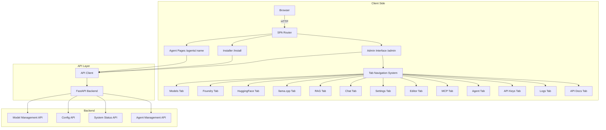
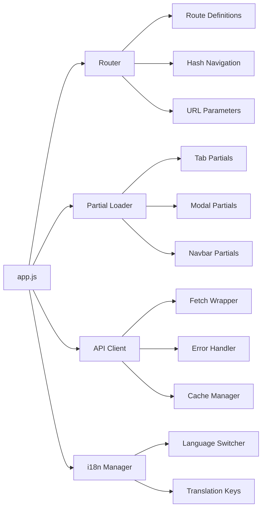

# Design Document: Admin Interface Refactoring

## Overview

This document describes the technical design for refactoring the admin interface in the AI Assistant project. The refactoring will restructure URL navigation, replace hardcoded model configuration with API-driven data fetching, and maintain the existing SPA architecture while improving maintainability and user experience.

### Key Objectives

1. **URL Restructuring**: Move admin interface from `/` to `/admin`, with dedicated routes for `/install` and `/agents/<name>`
2. **API-Driven Models**: Replace hardcoded `available_models.json` with dynamic fetching from `/api/v1/models`
3. **SPA Preservation**: Maintain existing Bootstrap 5, i18next, and modular JavaScript architecture
4. **Backward Compatibility**: Ensure existing bookmarks and links continue working

### Architecture Overview

The admin interface is a Single Page Application (SPA) served from `/static/interface/`. The refactoring will:

- Keep the existing SPA structure with partials for tabs
- Add client-side routing to handle `/admin`, `/install`, and `/agents/<name>`
- Maintain the same modular JavaScript structure in `static/interface/js/`
- Preserve all existing functionality and tabs

---

## Architecture

### System Architecture



### Component Architecture



---

## Components and Interfaces

### Router Component

**File**: `static/interface/js/router.js` (new)

Handles client-side routing for the admin interface.

#### Public API

```javascript
// Initialize router with route definitions
function initRouter(routes)

// Navigate to a specific path
function navigate(path, params = {})

// Get current route information
function getCurrentRoute()

// Handle hash changes for tab navigation
function handleHashChange()

// Redirect from root to /admin
function redirectRootToAdmin()
```

#### Route Definitions

```javascript
const ROUTES = {
    '/admin': {
        component: 'admin',
        tabs: ['models', 'foundry', 'hf', 'llama', 'rag', 'chat', 'settings', 'editor', 'mcp', 'agent', 'providers', 'logs', 'docs']
    },
    '/install': {
        component: 'installer',
        source: '/static/gui-install/'
    },
    '/agents/:name': {
        component: 'agent',
        params: ['name']
    }
};
```

### API Client Component

**File**: `static/interface/js/api.js` (new)

Centralized API client with caching, error handling, and debouncing.

#### Public API

```javascript
// Fetch with caching
async function get(url, options = {})

// Post with validation
async function post(url, body, options = {})

// Cache management
function cacheGet(key)
function cacheSet(key, value, ttl = 60000)

// Debounce helper
function debounce(fn, delay)

// Error handling
function handleApiError(error, context = {})
```

#### API Endpoints

| Endpoint | Method | Purpose | Cache |
|----------|--------|---------|-------|
| `/api/v1/health` | GET | Service health | No |
| `/api/v1/models` | GET | All available models | 60s |
| `/api/v1/foundry/models/loaded` | GET | Foundry models in memory | 10s |
| `/api/v1/foundry/models/cached` | GET | Foundry models on disk | 60s |
| `/api/v1/hf/models` | GET | HuggingFace models | 60s |
| `/api/v1/llama/status` | GET | llama.cpp status | 10s |
| `/api/v1/llama/models` | GET | llama.cpp models | 60s |
| `/api/v1/ollama/models` | GET | Ollama models | 60s |
| `/api/v1/rag/status` | GET | RAG status | 30s |
| `/api/v1/config` | GET | Current configuration | 60s |
| `/api/v1/config` | PATCH | Update configuration | No |
| `/api/v1/system/stats` | GET | System resource usage | 10s |

### Tab Navigation Component

**File**: `static/interface/js/tabs.js` (new)

Manages tab state and navigation.

#### Public API

```javascript
// Initialize tab navigation
function initTabs()

// Activate a specific tab
function activateTab(tabId)

// Get current active tab
function getActiveTab()

// Save tab state to URL hash
function saveTabState(tabId)

// Restore tab state from URL hash
function restoreTabState()
```

### Model Manager Component

**File**: `static/interface/js/models.js` (existing, enhanced)

Handles model data fetching, caching, and management.

#### Enhanced API

```javascript
// Fetch models from API with caching
async function refreshModels()

// Load a model into memory
async function loadModel(provider, modelId)

// Unload a model from memory
async function unloadModel(provider, modelId)

// Set active model
function setActiveModel(provider, modelId, prefix)

// Populate chat model selector
async function loadModels()
```

---

## Data Models

### Model Data Structure

```typescript
interface Model {
    id: string;                    // Unique identifier
    name: string;                  // Display name
    provider: 'foundry' | 'huggingface' | 'llama' | 'ollama';
    prefix: string;                // Model prefix for API routing
    size?: string;                 // Model size (e.g., "8.83 GB")
    device?: string;               // Device type (CPU/GPU)
    loaded: boolean;               // Whether model is loaded in memory
    cached: boolean;               // Whether model is available locally
    current?: boolean;             // Whether this is the active model
}

interface ModelResponse {
    models: Model[];
    current_model?: string;        // ID of currently active model
}
```

### Configuration Data Structure

```typescript
interface Config {
    fastapi_server: {
        api_port: number;
        host: string;
    };
    foundry_ai: {
        base_url: string;
        device: string;
    };
    rag_system: {
        enabled: boolean;
        index_path: string;
    };
    // ... other config sections
    app: {
        language: string;
        theme: string;
    };
}
```

### Route Data Structure

```typescript
interface Route {
    path: string;
    component: string;
    params?: string[];
    tabs?: string[];
    source?: string;
}
```

---

## Correctness Properties

*A property is a characteristic or behavior that should hold true across all valid executions of a system-essentially, a formal statement about what the system should do. Properties serve as the bridge between human-readable specifications and machine-verifiable correctness guarantees.*

### Property 1: API-driven model data consistency

*For any* valid API response from `/api/v1/models`, the interface SHALL display the same model data regardless of whether it was fetched from the API or previously cached, and the displayed data SHALL update immediately when the API response changes.

**Validates: Requirements 1.1, 1.2**

### Property 2: URL routing determinism

*For any* valid URL path (`/admin`, `/install`, `/agents/<name>`), the application SHALL load the correct interface component, and for invalid paths, the application SHALL display an appropriate error page with navigation options.

**Validates: Requirements 2.1, 2.2, 2.3, 2.5**

### Property 3: Root URL redirect behavior

*For any* request to the root URL (`/`), the application SHALL respond with a 302 redirect to `/admin`, and this redirect SHALL be consistent across all browsers and user agents.

**Validates: Requirements 2.4, 5.1**

### Property 4: Tab state preservation

*For any* sequence of tab navigations, the active tab state SHALL be preserved in the URL hash, and reloading the page SHALL restore the previously active tab.

**Validates: Requirements 3.4, 3.5, 5.2**

### Property 5: Error handling consistency

*For any* API endpoint failure (network error, timeout, invalid response), the interface SHALL display an appropriate error message to the user and allow retry of the operation without requiring a page reload.

**Validates: Requirements 1.3, 6.2, 6.4**

### Property 6: Configuration validation

*For any* configuration change attempt, the interface SHALL validate the input before sending to the API, and SHALL reject invalid configurations with appropriate error messages.

**Validates: Requirements 4.3, 9.2**

### Property 7: Language switching completeness

*For any* language selection (Russian, English, Hebrew), the interface SHALL apply the translation to all UI elements, and the selection SHALL persist across page reloads.

**Validates: Requirements 10.2, 10.4**

### Property 8: XSS prevention

*For any* dynamic content rendered from API responses or user input, the interface SHALL properly escape HTML entities to prevent cross-site scripting attacks.

**Validates: Requirements 9.5**

---

## Error Handling

### Error Categories

1. **Network Errors**: Connection failures, timeouts
2. **API Errors**: Invalid responses, validation errors
3. **Routing Errors**: Invalid URLs, missing agents
4. **Configuration Errors**: Invalid config values

### Error Handling Strategy

```javascript
// Error handling flow
function handleApiError(error, context) {
    if (error.name === 'AbortError') {
        // Request was cancelled
        return { message: 'Request cancelled', retry: false };
    }
    
    if (error.name === 'TypeError' && error.message.includes('fetch')) {
        // Network error
        return { message: 'Network error. Check connection.', retry: true };
    }
    
    if (error.status >= 500) {
        // Server error
        return { message: 'Server error. Try again later.', retry: true };
    }
    
    if (error.status >= 400) {
        // Client error
        return { message: 'Invalid request. Check your input.', retry: false };
    }
    
    // Unknown error
    return { message: 'Unexpected error. See logs for details.', retry: false };
}
```

### User Feedback

- **Loading states**: Show spinner during API calls
- **Success messages**: Green toast notification
- **Error messages**: Red toast with retry option
- **Warning messages**: Yellow toast for non-critical issues

---

## Testing Strategy

### Dual Testing Approach

- **Unit tests**: Verify specific examples, edge cases, and error conditions
- **Property tests**: Verify universal properties across all inputs (when applicable)
- Together: Comprehensive coverage (unit tests catch concrete bugs, property tests verify general correctness)

### Property-Based Testing

Property-based testing IS appropriate for this feature because:

1. The core logic involves pure functions (routing, validation, data transformation)
2. There are universal properties that should hold across all inputs
3. The input space is large and varied (URLs, API responses, configurations)
4. Property-based tests can efficiently test edge cases

**Property-Based Testing Library**: `fast-check` (JavaScript)

**Test Configuration**:
- Minimum 100 iterations per property test
- Each test tagged with **Feature: admin-interface-refactor, Property {number}: {property_text}**

### Test Categories

#### Property-Based Tests (100+ iterations)

1. **API-driven model data consistency** (Property 1)
   - Generate random model API responses
   - Verify caching and display consistency
   - Test with various model counts and structures

2. **URL routing determinism** (Property 2)
   - Generate random valid and invalid URLs
   - Verify correct component loading
   - Test edge cases (empty paths, special characters)

3. **Configuration validation** (Property 6)
   - Generate valid and invalid configuration values
   - Verify validation logic
   - Test boundary conditions

4. **Language switching completeness** (Property 7)
   - Generate random translation keys
   - Verify all UI elements update
   - Test persistence across reloads

#### Example-Based Tests (specific scenarios)

1. **Root URL redirect** (Property 3)
   - Test `/` → `/admin` redirect
   - Verify 302 status code
   - Test with various query parameters

2. **Tab state preservation** (Property 4)
   - Test tab navigation sequence
   - Verify URL hash updates
   - Test page reload restoration

3. **Error handling** (Property 5)
   - Test specific error scenarios
   - Verify user feedback
   - Test retry functionality

#### Integration Tests (1-3 examples)

1. **End-to-end admin interface**
   - Load admin interface
   - Navigate all tabs
   - Verify all functionality

2. **Model loading workflow**
   - Load a model
   - Verify it appears in active list
   - Verify it can be used for chat

3. **Configuration persistence**
   - Change configuration
   - Verify it saves to config.json
   - Verify it persists across restarts

### Test Coverage Targets

- **Unit tests**: 90%+ coverage for pure functions
- **Property tests**: All testable acceptance criteria
- **Integration tests**: Critical user workflows
- **E2E tests**: Main user journeys

---

## Implementation Plan

### Phase 1: Core Infrastructure (Week 1)

1. Create `static/interface/js/router.js`
2. Create `static/interface/js/api.js`
3. Create `static/interface/js/tabs.js`
4. Update `app.js` to use new components

### Phase 2: URL Restructuring (Week 1-2)

1. Implement `/admin` route
2. Implement `/install` route
3. Implement `/agents/<name>` route
4. Add root URL redirect

### Phase 3: API Integration (Week 2)

1. Update `models.js` to fetch from `/api/v1/models`
2. Implement caching layer
3. Add error handling
4. Add debouncing for rate limiting

### Phase 4: Backward Compatibility (Week 2-3)

1. Implement legacy URL handling
2. Add migration for deprecated config keys
3. Test existing bookmarks and links

### Phase 5: Testing (Week 3)

1. Write property-based tests
2. Write example-based tests
3. Write integration tests
4. Performance testing

---

## Performance Considerations

### Caching Strategy

- **API responses**: Cache for 60 seconds (configurable per endpoint)
- **Static assets**: Cache with appropriate headers (1 year)
- **Model data**: Cache for 10 seconds during active use

### Loading Optimization

- **Lazy loading**: Load partials only when needed
- **Virtual scrolling**: For lists exceeding 100 items
- **Progressive disclosure**: Show loading state, update incrementally

### Bundle Optimization

- **Code splitting**: Separate router, API, and tab modules
- **Tree shaking**: Remove unused code
- **Minification**: Minify JavaScript and CSS

---

## Security Considerations

### Input Validation

- Validate all user inputs before sending to API
- Sanitize HTML content to prevent XSS
- Escape special characters in dynamic content

### Authentication

- Handle authentication tokens securely
- Use HTTPS for all API calls
- Store tokens in memory, not localStorage

### Authorization

- Verify user permissions for sensitive operations
- Require confirmation for destructive actions
- Log configuration changes with user context

---

## Localization

### Translation Keys

- Maintain existing i18n structure
- Add new keys for router and API messages
- Support Russian, English, and Hebrew

### Fallback Strategy

- Fall back to English if translation is missing
- Log missing keys for translation updates
- Support right-to-left (RTL) for Hebrew

---

## Migration Strategy

### Configuration Migration

- Check for deprecated config keys on load
- Automatically migrate to new structure
- Log migration actions with timestamps

### Data Migration

- Migrate cached model data if structure changes
- Preserve user preferences across versions
- Handle schema versioning

---

## Rollback Plan

### Quick Rollback

- Keep old interface files in `static/interface/old/`
- Maintain backward-compatible API endpoints
- Document rollback procedures

### Monitoring

- Track error rates after deployment
- Monitor performance metrics
- Collect user feedback

---

## Success Criteria

1. All existing functionality preserved
2. Admin interface accessible at `/admin`
3. Models fetched from API, not hardcoded JSON
4. All tabs functional with proper routing
5. Backward compatibility maintained
6. Performance within acceptable limits (<2s load time)
7. Error handling provides clear user feedback
8. All testable acceptance criteria covered by tests

---

## Open Questions

1. Should the installer (`/install`) be a separate SPA or integrated into the main interface?
2. How should agent pages handle authentication?
3. Should the interface support offline mode with full caching?

---

## References

- [FastAPI Documentation](https://fastapi.tiangolo.com/)
- [Bootstrap 5 Documentation](https://getbootstrap.com/docs/5.3/)
- [i18next Documentation](https://www.i18next.com/)
- [fast-check Documentation](https://dubzzz.github.io/fast-check/)