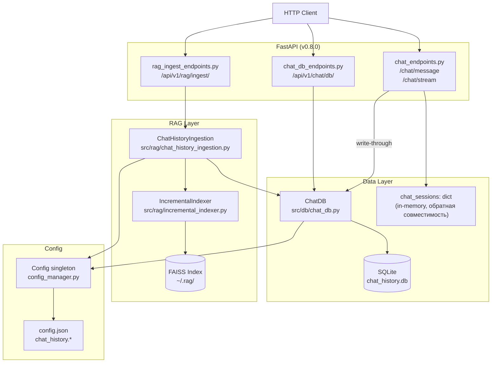
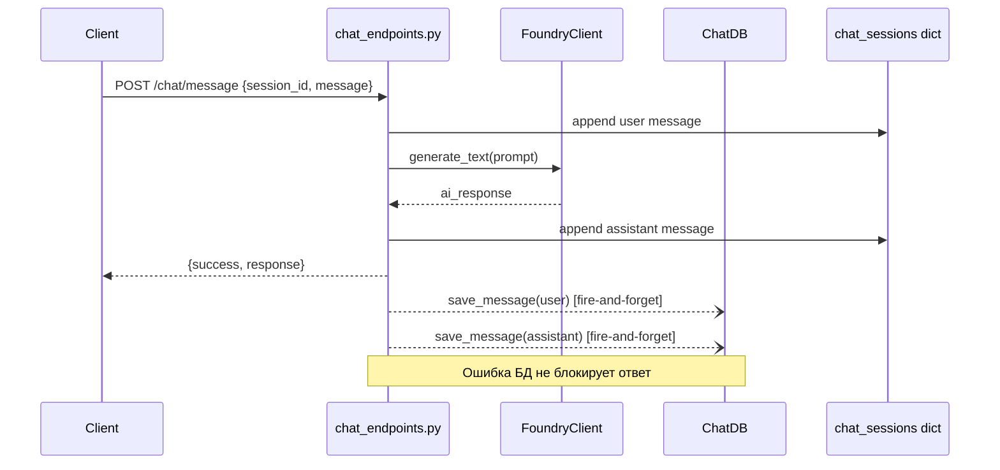
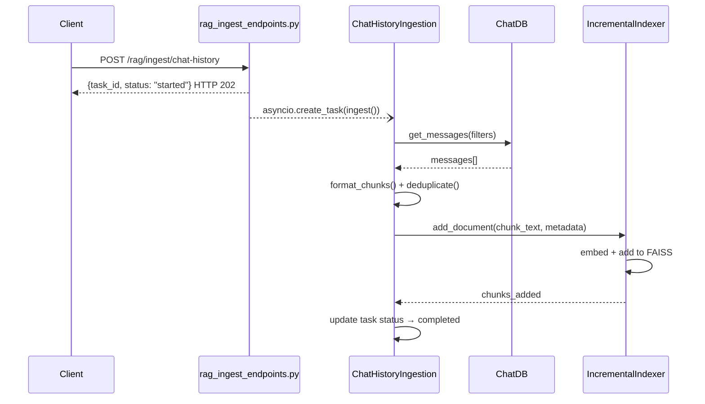

# Дизайн: Chat History DB + RAG Integration

**Версия:** 0.8.0  
**Дата:** 2026  
**Автор:** hypo69  
**Статус:** Черновик

---

## Обзор

Функциональность добавляет постоянное хранилище истории чатов на базе SQLite
(через `aiosqlite`) и конвейер RAG-индексации диалогов в существующий FAISS-индекс.

Текущее состояние (v0.7.x): сессии хранятся в памяти (`chat_sessions: dict`) и
опционально сбрасываются в JSON-файлы на диск через `POST /chat/history/save`.
При перезапуске сервера in-memory история теряется.

Целевое состояние (v0.8.0):
- Каждое сообщение автоматически записывается в SQLite при прохождении через
  `/chat/message` и `/chat/stream` (write-through).
- Полный CRUD для истории доступен через новые эндпоинты `/api/v1/chat/db/`.
- Диалоги можно индексировать в FAISS через эндпоинты `/api/v1/rag/ingest/`.
- In-memory словарь `chat_sessions` сохраняется для обратной совместимости в v0.8.0.

### Ключевые решения

| Решение | Обоснование |
|---|---|
| SQLite + aiosqlite | Нет внешних зависимостей, встроен в Python, поддерживает async |
| Write-through в существующих эндпоинтах | Прозрачная миграция без изменения клиентского кода |
| Инкрементальное обновление FAISS | Переиспользование `IncrementalIndexer` из v0.7.1 |
| Фоновые задачи через `asyncio.Task` | Не блокирует HTTP-ответ при индексации |
| Pydantic v2 схемы в отдельном файле | Единый источник истины для валидации и OpenAPI |

---

## Архитектура



### Поток данных: write-through при /chat/message



### Поток данных: RAG-индексация



---

## Компоненты и интерфейсы

### `src/db/chat_db.py` — класс `ChatDB`

Единственный компонент доступа к SQLite. Все методы асинхронные.

```python
class DatabaseInitError(Exception):
    """Выбрасывается при невозможности инициализировать БД."""

class ChatDB:
    def __init__(self, db_path: str) -> None: ...

    async def initialize(self) -> None:
        """Создаёт таблицы и индексы если не существуют.
        Raises: DatabaseInitError
        """

    async def create_session(
        self, session_id: str, model: str = "", title: str = ""
    ) -> SessionRecord: ...

    async def save_message(
        self, session_id: str, role: str, content: str, timestamp: int | None = None
    ) -> MessageRecord: ...

    async def get_session_history(
        self, session_id: str
    ) -> list[MessageRecord]: ...

    async def list_sessions(
        self, limit: int = 50, offset: int = 0
    ) -> tuple[list[SessionRecord], int]: ...

    async def delete_session(self, session_id: str) -> bool: ...

    async def session_exists(self, session_id: str) -> bool: ...

    async def get_messages_since(
        self, since_timestamp: int, session_ids: list[str] | None = None
    ) -> list[dict]: ...

    async def close(self) -> None: ...
```

**Синглтон модульного уровня:**

```python
# src/db/chat_db.py
_chat_db: ChatDB | None = None

async def get_chat_db() -> ChatDB:
    """Возвращает (или создаёт) синглтон ChatDB, инициализированный из config."""
```

### `src/db/schemas.py` — Pydantic v2 схемы

```python
from pydantic import BaseModel, field_validator, UUID4
from typing import Literal

class MessageRecord(BaseModel):
    role: Literal["user", "assistant", "system"]
    content: str
    timestamp: int

class SessionRecord(BaseModel):
    session_id: str
    model: str
    title: str
    created_at: int
    updated_at: int
    message_count: int
    aborted: bool

class StartSessionRequest(BaseModel):
    model: str = "default"
    title: str = ""

class SaveMessageRequest(BaseModel):
    session_id: str          # UUID v4, валидируется через field_validator
    role: Literal["user", "assistant", "system"]
    content: str             # непустая строка, валидируется через field_validator

    @field_validator("content")
    @classmethod
    def content_not_empty(cls, v: str) -> str: ...

    @field_validator("session_id")
    @classmethod
    def session_id_is_uuid4(cls, v: str) -> str: ...

class SessionListResponse(BaseModel):
    success: bool
    sessions: list[SessionRecord]
    total: int

class SessionHistoryResponse(BaseModel):
    success: bool
    session_id: str
    messages: list[MessageRecord]

class IngestRequest(BaseModel):
    session_ids: list[str] | None = None
    since_timestamp: int | None = None

class IngestStatusResponse(BaseModel):
    task_id: str
    status: Literal["running", "completed", "failed"]
    chunks_added: int
    duration_seconds: float | None
    error: str | None
```

### `src/api/endpoints/chat_db_endpoints.py` — CRUD эндпоинты

Роутер с префиксом `/chat/db` (подключается в `app.py` под `/api/v1`).

| Метод | Путь | Описание | HTTP |
|---|---|---|---|
| POST | `/chat/db/session/start` | Создать сессию | 201 |
| POST | `/chat/db/message` | Сохранить сообщение | 200 |
| GET | `/chat/db/session/{session_id}` | История сессии | 200 |
| GET | `/chat/db/sessions` | Список сессий | 200 |
| DELETE | `/chat/db/session/{session_id}` | Удалить сессию | 200 |

### `src/rag/chat_history_ingestion.py` — класс `ChatHistoryIngestion`

```python
class ChatHistoryIngestion:
    def __init__(self, chat_db: ChatDB, indexer: IncrementalIndexer) -> None: ...

    async def ingest(
        self,
        session_ids: list[str] | None = None,
        since_timestamp: int | None = None,
    ) -> dict:
        """Запускает полный цикл индексации.
        Returns: {chunks_added, duration_seconds, sessions_processed}
        """

    def _format_chunk_text(self, role: str, content: str) -> str:
        """Форматирует сообщение в строку '[{role}] {content}'."""

    def _split_chunks(self, text: str) -> list[str]:
        """Разбивает текст на части с перекрытием 10% от chunk_size."""

    def _deduplicate(self, chunks: list[str]) -> list[str]:
        """Удаляет дубликаты, сохраняя порядок."""
```

### `src/api/endpoints/rag_ingest_endpoints.py` — RAG эндпоинты

Роутер с префиксом `/rag/ingest` (подключается в `app.py` под `/api/v1`).

| Метод | Путь | Описание | HTTP |
|---|---|---|---|
| POST | `/rag/ingest/chat-history` | Запустить индексацию | 202 |
| GET | `/rag/ingest/status/{task_id}` | Статус задачи | 200 |

**Хранилище задач** (in-memory dict в модуле):

```python
_tasks: dict[str, IngestStatusResponse] = {}
_running_task: asyncio.Task | None = None
```

---

## Модели данных

### Схема SQLite

```sql
CREATE TABLE IF NOT EXISTS chat_sessions (
    session_id   TEXT    PRIMARY KEY,
    model        TEXT    NOT NULL DEFAULT '',
    title        TEXT    NOT NULL DEFAULT '',
    created_at   INTEGER NOT NULL,
    updated_at   INTEGER NOT NULL,
    message_count INTEGER NOT NULL DEFAULT 0,
    aborted      INTEGER NOT NULL DEFAULT 0
);

CREATE TABLE IF NOT EXISTS chat_messages (
    id         INTEGER PRIMARY KEY AUTOINCREMENT,
    session_id TEXT    NOT NULL,
    role       TEXT    NOT NULL,
    content    TEXT    NOT NULL,
    timestamp  INTEGER NOT NULL,
    FOREIGN KEY (session_id) REFERENCES chat_sessions(session_id) ON DELETE CASCADE
);

CREATE INDEX IF NOT EXISTS idx_messages_session_id
    ON chat_messages(session_id);
```

### Секция `chat_history` в `config.json`

```json
"chat_history": {
    "db_path": "~/.ai_assist/chat_history.db",
    "retention_days": 90,
    "max_sessions": 10000,
    "rag_auto_ingest": false
}
```

### Новые свойства `Config` в `config_manager.py`

```python
@property
def chat_history_db_path(self) -> str:
    raw = self._config_data.get("chat_history", {}).get("db_path") or "~/.ai_assist/chat_history.db"
    return str(Path(raw).expanduser())

@property
def chat_history_retention_days(self) -> int:
    return self._config_data.get("chat_history", {}).get("retention_days", 90)

@property
def chat_history_max_sessions(self) -> int:
    return self._config_data.get("chat_history", {}).get("max_sessions", 10000)

@property
def chat_history_rag_auto_ingest(self) -> bool:
    return self._config_data.get("chat_history", {}).get("rag_auto_ingest", False)
```

### Формат чанка для RAG

```
[user] Как настроить RAG в проекте?
```

Метаданные чанка (передаются в `IncrementalIndexer.add_document`):

```python
{
    "source": "chat_history",
    "session_id": "<uuid>",
    "timestamp": 1700000000,
    "role": "user"
}
```

---

## Свойства корректности

*Свойство — это характеристика или поведение, которое должно выполняться при всех
допустимых выполнениях системы. Свойства служат мостом между читаемыми
человеком спецификациями и машинно-верифицируемыми гарантиями корректности.*

### Свойство 1: Round-trip сериализации Pydantic-схем

*Для любого* валидного объекта `MessageRecord` (с произвольными допустимыми
значениями `role`, непустым `content` и любым `timestamp`) — сериализация через
`model_dump()` и последующая десериализация через `model_validate()` должны
производить объект, эквивалентный исходному.

**Validates: Requirements 2.1, 9.5**

---

### Свойство 2: Round-trip сериализации SessionRecord

*Для любого* валидного объекта `SessionRecord` с произвольными допустимыми
значениями полей — сериализация в JSON и десериализация обратно должны
производить эквивалентный объект.

**Validates: Requirements 2.2**

---

### Свойство 3: Валидация пустого content

*Для любой* строки `content`, состоящей исключительно из пробельных символов
(включая пустую строку), — создание `SaveMessageRequest` с таким `content`
должно вызывать ошибку валидации Pydantic (`ValidationError`).

**Validates: Requirements 2.7**

---

### Свойство 4: Валидация session_id не-UUID

*Для любой* строки, не являющейся валидным UUID v4, — создание
`SaveMessageRequest` с таким `session_id` должно вызывать ошибку валидации
Pydantic (`ValidationError`).

**Validates: Requirements 2.8**

---

### Свойство 5: Round-trip хранения сообщений в Chat_DB

*Для любого* набора сообщений с произвольными допустимыми значениями полей —
после последовательного сохранения в `ChatDB` и последующего чтения через
`get_session_history()` должны возвращаться сообщения в том же порядке
(по возрастанию `timestamp`) и с теми же значениями полей `role`, `content`,
`timestamp`.

**Validates: Requirements 3.3, 9.6**

---

### Свойство 6: Монотонный рост message_count

*Для любой* сессии — после каждого вызова `save_message()` значение
`message_count` в записи `chat_sessions` должно увеличиваться ровно на 1.

**Validates: Requirements 3.2**

---

### Свойство 7: Каскадное удаление сессии

*Для любой* сессии с произвольным количеством сообщений — после вызова
`delete_session()` ни сессия, ни её сообщения не должны возвращаться при
последующих запросах `session_exists()` и `get_session_history()`.

**Validates: Requirements 3.5**

---

### Свойство 8: Формат текста чанка

*Для любого* сообщения с произвольными допустимыми значениями `role` и
`content` — текст сформированного чанка должен точно соответствовать шаблону
`"[{role}] {content}"`.

**Validates: Requirements 5.1**

---

### Свойство 9: Ограничение размера чанка

*Для любого* текста длиннее `chunk_size` символов — все сформированные чанки
должны иметь длину не более `chunk_size` символов.

**Validates: Requirements 5.2**

---

### Свойство 10: Полнота чанкирования

*Для любой* строки `content` длиной от 1 до 10 000 символов — конвейер
`ChatHistoryIngestion` должен формировать хотя бы один чанк.

**Validates: Requirements 5.2, 9.7**

---

### Свойство 11: Дедупликация чанков

*Для любого* набора текстов, содержащего дубликаты, — после дедупликации
количество уникальных чанков должно равняться количеству уникальных строк
в исходном наборе (без дубликатов).

**Validates: Requirements 5.7**

---

### Свойство 12: Инкрементальный рост FAISS-индекса

*Для любого* набора из N уникальных чанков — после их добавления через
`ChatHistoryIngestion.ingest()` значение `ntotal` FAISS-индекса должно
увеличиться ровно на N.

**Validates: Requirements 5.4**

---

### Свойство 13: Фильтрация индексации по session_ids

*Для любого* подмножества `session_ids` — конвейер индексации должен
обрабатывать только сообщения из указанных сессий; сообщения из других
сессий не должны попадать в индекс.

**Validates: Requirements 6.3**

---

### Свойство 14: Фильтрация индексации по since_timestamp

*Для любого* значения `since_timestamp` — все проиндексированные чанки
должны иметь `timestamp` строго больше `since_timestamp`.

**Validates: Requirements 6.4**

---

## Обработка ошибок

### Стратегия по компонентам

| Компонент | Ошибка | Поведение |
|---|---|---|
| `ChatDB.initialize()` | Файл БД недоступен / повреждён | Выбросить `DatabaseInitError`, записать в лог |
| `ChatDB.save_message()` | Любая ошибка SQLite | Выбросить исключение (caller решает) |
| `chat_endpoints.py` write-through | Ошибка `save_message` | Поймать, записать в лог, вернуть ответ клиенту |
| `chat_db_endpoints.py` | `session_id` не найден | HTTP 404 |
| `chat_db_endpoints.py` | Ошибка валидации Pydantic | HTTP 422 (автоматически FastAPI) |
| `rag_ingest_endpoints.py` | Задача уже выполняется | HTTP 409 |
| `rag_ingest_endpoints.py` | `task_id` не найден | HTTP 404 |
| `ChatHistoryIngestion.ingest()` | Любая ошибка | Записать полный traceback в лог, установить `status=failed` |
| `Config` | Секция `chat_history` отсутствует | Использовать значения по умолчанию |

### Инициализация ChatDB при старте приложения

`ChatDB` инициализируется в `lifespan()` функции `app.py`. При ошибке
инициализации (`DatabaseInitError`) приложение логирует предупреждение и
продолжает работу без SQLite-хранилища (деградированный режим). Эндпоинты
`/chat/db/*` в этом случае возвращают HTTP 503.

### Write-through: изоляция ошибок

```python
# chat_endpoints.py — паттерн fire-and-forget с изоляцией
async def _save_to_db_safe(session_id: str, role: str, content: str) -> None:
    try:
        db = await get_chat_db()
        await db.save_message(session_id, role, content)
    except Exception:
        logger.exception("ChatDB write-through failed, continuing without persistence")

# В обработчике /chat/message:
asyncio.create_task(_save_to_db_safe(session_id, "user", message))
asyncio.create_task(_save_to_db_safe(session_id, "assistant", ai_response))
```

---

## Стратегия тестирования

### Обзор

Используется двойной подход: юнит-тесты для конкретных примеров и граничных
случаев, property-based тесты для универсальных свойств.

Библиотека PBT: **`hypothesis`** (стандартный выбор для Python).
Каждый property-тест запускается минимум 100 итераций (настройка `@settings(max_examples=100)`).

### Структура тестов

```
tests/
├── unit/
│   ├── test_chat_db.py          # ChatDB: CRUD, схема, каскадное удаление
│   ├── test_schemas.py          # Pydantic схемы: валидация, round-trip (PBT)
│   └── test_chat_ingestion.py   # ChatHistoryIngestion: чанкирование, дедупликация (PBT)
├── integration/
│   ├── test_chat_db_endpoints.py  # httpx.AsyncClient + SQLite :memory:
│   └── test_rag_ingest_endpoints.py  # httpx.AsyncClient + мок IncrementalIndexer
└── conftest.py                  # Фикстуры: in-memory ChatDB, тестовый app
```

### Property-based тесты (Hypothesis)

Каждый тест аннотирован тегом для трассировки к свойству дизайна:

```python
# Feature: chat-history-db, Property 1: Round-trip сериализации Pydantic-схем
@settings(max_examples=100)
@given(
    role=st.sampled_from(["user", "assistant", "system"]),
    content=st.text(min_size=1),
    timestamp=st.integers(min_value=0),
)
def test_message_record_round_trip(role, content, timestamp):
    original = MessageRecord(role=role, content=content, timestamp=timestamp)
    restored = MessageRecord.model_validate(original.model_dump())
    assert original == restored
```

### Юнит-тесты `ChatDB`

- Создание таблиц при инициализации (SMOKE)
- Сохранение и получение сессии
- Сохранение сообщения и проверка `message_count`
- Получение истории в хронологическом порядке
- Удаление сессии с каскадным удалением сообщений
- `DatabaseInitError` при повреждённом файле (EDGE_CASE)

### Юнит-тесты `ChatHistoryIngestion`

- Формат чанка `[role] content` (PBT — Свойство 8)
- Разбивка длинных чанков (PBT — Свойство 9)
- Полнота чанкирования (PBT — Свойство 10)
- Дедупликация (PBT — Свойство 11)
- Мок `SentenceTransformer` и `IncrementalIndexer`

### Интеграционные тесты эндпоинтов

- `POST /chat/db/session/start` → HTTP 201, уникальный `session_id`
- `POST /chat/db/message` → HTTP 200, `message_count` растёт
- `GET /chat/db/session/{id}` → хронологический порядок
- `GET /chat/db/sessions` → сортировка по `updated_at` DESC
- `DELETE /chat/db/session/{id}` → HTTP 200, каскадное удаление
- `GET/DELETE` с несуществующим `session_id` → HTTP 404
- `POST /rag/ingest/chat-history` → HTTP 202, `task_id`
- `GET /rag/ingest/status/{task_id}` → корректный статус
- Повторный `POST /rag/ingest/chat-history` при активной задаче → HTTP 409

### Тесты граничных значений Pydantic-схем

- Пустой `content` → `ValidationError`
- `content` из пробелов → `ValidationError`
- Неверный `role` → `ValidationError`
- Неверный формат `session_id` (не UUID v4) → `ValidationError`
- Максимальная длина `content` (10 000 символов) → успех

### Конфигурация Hypothesis

```python
# conftest.py
from hypothesis import settings, HealthCheck

settings.register_profile(
    "ci",
    max_examples=100,
    suppress_health_check=[HealthCheck.too_slow],
)
settings.load_profile("ci")
```
