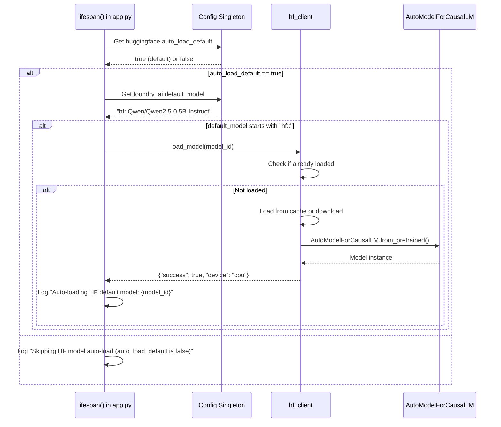

# Design Document: HuggingFace Auto-Load Control

## Overview

This feature adds configuration control over automatic HuggingFace model loading at application startup. Currently, when `foundry_ai.default_model` starts with "hf::", the HuggingFace model is automatically loaded into the FastAPI process memory. This behavior cannot be disabled, which may be undesirable for users who want to manage model loading manually or use alternative backends.

The feature introduces a new `huggingface.auto_load_default` boolean setting that allows users to disable automatic HuggingFace model loading while maintaining backward compatibility with the existing behavior.

### Key Design Goals

1. **Backward Compatibility**: Default behavior unchanged (auto-load enabled)
2. **Independent Backend Control**: Each backend (Foundry, HuggingFace, llama.cpp, Ollama, LM Studio) has its own auto-load setting
3. **Configuration Persistence**: Setting saved to `config.json`
4. **Environment Variable Support**: Configurable via `HF_AUTO_LOAD_DEFAULT`
5. **Clear Logging**: Decisions are logged for debugging and verification

## Architecture

### Configuration Structure

```
config.json
├── huggingface
│   ├── models_dir: str (existing)
│   ├── device: str (existing)
│   ├── default_max_new_tokens: int (existing)
│   ├── default_temperature: float (existing)
│   └── auto_load_default: bool (NEW) ← Default: true
```

### Code Flow

```
Application Startup
    ↓
lifespan() function in src/api/app.py
    ↓
Check foundry_ai.auto_load_default
    ↓
Check huggingface.auto_load_default (NEW)
    ↓
If both false → Skip all auto-load
If huggingface.auto_load_default true AND default_model starts with "hf::"
    ↓
Load HuggingFace model via hf_client.load_model()
```

### Component Interactions



## Components and Interfaces

### 1. Configuration Properties (config_manager.py)

Add new property to `Config` class:

```python
@property
def huggingface_auto_load_default(self) -> bool:
    """Control automatic HuggingFace model loading at startup.
    
    Priority:
        1. HF_AUTO_LOAD_DEFAULT environment variable
        2. huggingface.auto_load_default from config.json
        3. Default value: True (backward compatibility)
    
    Returns:
        bool: True to auto-load, False to skip
    """
    # Check environment variable first
    env_value = os.getenv('HF_AUTO_LOAD_DEFAULT')
    if env_value is not None:
        try:
            return env_value.lower() in ('true', '1', 'yes')
        except Exception:
            logger.warning("Invalid HF_AUTO_LOAD_DEFAULT value, using default")
    
    # Check config.json
    return self._config_data.get('huggingface', {}).get('auto_load_default', True)
```

### 2. Auto-Load Logic (src/api/app.py)

Modify the lifespan function to check the new setting:

```python
# Auto-load default model if it points to a specific backend
try:
    import asyncio
    from ..core.config import config as _cfg
    from ..models.hf_client import hf_client as _hf_client
    default_model: str = _cfg.foundry_default_model or ""

    if default_model.startswith("hf::"):
        # HuggingFace: load model into FastAPI process memory at startup
        hf_model_id = default_model[len("hf::"):]
        if hf_model_id:
            # NEW: Check huggingface.auto_load_default
            if _cfg.huggingface_auto_load_default:
                logger.info("🤗 Auto-loading HF default model: %s", hf_model_id)
                loop = asyncio.get_event_loop()
                result = await loop.run_in_executor(None, _hf_client.load_model, hf_model_id)
                if result.get("success"):
                    logger.info("✅ HF model loaded: %s on %s", hf_model_id, result.get("device"))
                else:
                    logger.warning("⚠️ HF model auto-load failed: %s", result.get("error"))
            else:
                logger.info("Skipping HF model auto-load (auto_load_default is false)")
```

### 3. Configuration Validation

Add validation in config update operations:

```python
def validate_huggingface_auto_load_default(value: Any) -> tuple[bool, str]:
    """Validate huggingface.auto_load_default value.
    
    Args:
        value: Value to validate
        
    Returns:
        tuple: (is_valid: bool, error_message: str)
    """
    if isinstance(value, bool):
        return True, ""
    return False, f"huggingface.auto_load_default must be boolean, got {type(value).__name__}"
```

## Data Models

### Configuration Schema

```json
{
  "huggingface": {
    "models_dir": "~/.cache/huggingface/hub",
    "device": "auto",
    "default_max_new_tokens": 512,
    "default_temperature": 0.7,
    "auto_load_default": true
  }
}
```

### Environment Variable

| Variable | Type | Default | Description |
|----------|------|---------|-------------|
| `HF_AUTO_LOAD_DEFAULT` | string | `true` | Set to "false" to disable auto-load |

## Correctness Properties

*A property is a characteristic or behavior that should hold true across all valid executions of a system-essentially, a formal statement about what the system should do. Properties serve as the bridge between human-readable specifications and machine-verifiable correctness guarantees.*

### Property 1: Auto-load enabled loads HF model

*For any* configuration where `huggingface.auto_load_default` is `true` (or not specified) and `foundry_ai.default_model` starts with "hf::", the system SHALL load the HuggingFace model at startup.

**Validates: Requirements 1.1, 5.1, 5.2**

### Property 2: Auto-load disabled skips HF model

*For any* configuration where `huggingface.auto_load_default` is `false` and `foundry_ai.default_model` starts with "hf::", the system SHALL NOT load the HuggingFace model at startup.

**Validates: Requirements 1.2**

### Property 3: Default value is true

*For any* configuration where `huggingface.auto_load_default` is not specified, the system SHALL default to `true` and behave identically to the current implementation.

**Validates: Requirements 1.3, 5.1**

### Property 4: Boolean validation

*For any* value assigned to `huggingface.auto_load_default`, if the value is not a boolean, the system SHALL log an error and use the default value of `true`.

**Validates: Requirements 1.4, 1.5**

### Property 5: Independent backend control

*For any* configuration, the `huggingface.auto_load_default` setting SHALL operate independently of `foundry_ai.auto_load_default` and other backend auto-load settings.

**Validates: Requirements 2.1, 2.2, 2.3, 2.4**

### Property 6: Configuration persistence

*For any* value assigned to `huggingface.auto_load_default`, the system SHALL save it to `config.json` and restore it on restart.

**Validates: Requirements 3.1, 3.2, 3.3**

### Property 7: Logging for decisions

*For any* startup scenario, the system SHALL log either "Auto-loading HF default model: {model_id}" or "Skipping HF model auto-load (auto_load_default is false)" depending on the configuration.

**Validates: Requirements 4.1, 4.2, 4.3**

### Property 8: Environment variable override

*For any* configuration, the `HF_AUTO_LOAD_DEFAULT` environment variable SHALL take precedence over the value in `config.json`.

**Validates: Requirements 5.3 (indirectly - environment override)**

## Error Handling

### Invalid Configuration Value

```python
# In config_manager.py
@property
def huggingface_auto_load_default(self) -> bool:
    env_value = os.getenv('HF_AUTO_LOAD_DEFAULT')
    if env_value is not None:
        try:
            return env_value.lower() in ('true', '1', 'yes')
        except Exception:
            logger.warning("Invalid HF_AUTO_LOAD_DEFAULT value, using default")
    
    raw = self._config_data.get('huggingface', {}).get('auto_load_default')
    if raw is None:
        return True  # Default
    
    if not isinstance(raw, bool):
        logger.error("huggingface.auto_load_default must be boolean, got %s", type(raw).__name__)
        return True  # Fallback to default
    
    return raw
```

### Empty or Non-HF Model

```python
# In app.py lifespan()
if default_model.startswith("hf::"):
    hf_model_id = default_model[len("hf::"):]
    if hf_model_id:  # Empty check
        if _cfg.huggingface_auto_load_default:
            # Load model
        else:
            logger.info("Skipping HF model auto-load (auto_load_default is false)")
    # else: empty model_id, skip silently
else:
    # Not HF model, skip
```

## Testing Strategy

### Dual Testing Approach

**Unit tests**: Verify specific examples, edge cases, and error conditions
**Property tests**: Verify universal properties across all inputs

Both are complementary and necessary for comprehensive coverage.

### Property-Based Testing

**Library**: `pytest` with `hypothesis` for property-based testing

**Configuration**: Each test runs minimum 100 iterations

**Tag format**: `Feature: huggingface-auto-load-control, Property {number}: {property_text}`

### Test Categories

#### 1. Property Tests (100+ iterations each)

| Property | Test Description | Tag |
|----------|-----------------|-----|
| P1 | Auto-load enabled loads HF model | `Feature: huggingface-auto-load-control, Property 1` |
| P2 | Auto-load disabled skips HF model | `Feature: huggingface-auto-load-control, Property 2` |
| P3 | Default value is true | `Feature: huggingface-auto-load-control, Property 3` |
| P5 | Independent backend control | `Feature: huggingface-auto-load-control, Property 5` |
| P6 | Configuration persistence | `Feature: huggingface-auto-load-control, Property 6` |
| P7 | Logging for decisions | `Feature: huggingface-auto-load-control, Property 7` |
| P8 | Environment variable override | `Feature: huggingface-auto-load-control, Property 8` |

#### 2. Unit Tests (Specific Examples)

| Scenario | Test Description |
|----------|-----------------|
| U1 | Empty `foundry_ai.default_model` → no auto-load |
| U2 | Non-HF prefix (foundry::, llama::, etc.) → no HF auto-load |
| U3 | Invalid config value (string, number) → error logged, default used |
| U4 | Environment variable "false" → auto-load disabled |
| U5 | Environment variable "true" → auto-load enabled |
| U6 | Both backends disabled → neither loads |
| U7 | Both backends enabled → both load if applicable |

#### 3. Integration Tests

| Scenario | Test Description |
|----------|-----------------|
| I1 | Full startup with auto-load enabled |
| I2 | Full startup with auto-load disabled |
| I3 | Config save/load cycle preserves setting |
| I4 | Environment variable overrides config.json |

### Test Implementation Examples

```python
# tests/test_hf_auto_load.py
import pytest
from hypothesis import given, strategies as st
from hypothesis import settings as hypothesis_settings

# Set hypothesis to run more iterations for critical properties
hypothesis_settings.register_profile("ci", max_examples=100)
hypothesis_settings.load_profile("ci")

class TestHFAutoLoadProperties:
    """Property-based tests for huggingface.auto_load_default."""
    
    @pytest.mark.property1
    @given(auto_load=st.booleans(), model_id=st.text(min_size=5))
    def test_auto_load_enabled_loads_hf_model(self, auto_load, model_id):
        """Property 1: Auto-load enabled loads HF model."""
        # Generate config with auto_load setting
        # Generate mock default_model starting with "hf::"
        # Verify model loads when auto_load is True
        
    @pytest.mark.property2
    @given(auto_load=st.just(False), model_id=st.text(min_size=5))
    def test_auto_load_disabled_skips_hf_model(self, auto_load, model_id):
        """Property 2: Auto-load disabled skips HF model."""
        # Verify model does NOT load when auto_load is False

class TestHFAutoLoadUnit:
    """Unit tests for specific scenarios."""
    
    def test_empty_model_id_no_autoload(self):
        """U1: Empty default_model → no auto-load."""
        # Test with empty string
        
    def test_non_hf_prefix_no_autoload(self):
        """U2: Non-HF prefix → no HF auto-load."""
        # Test with foundry::, llama::, ollama::, lmstudio:: prefixes
        
    def test_invalid_config_value_logs_error(self):
        """U3: Invalid config value → error logged."""
        # Test with string, number, null values
```

### Test Coverage Requirements

| Requirement | Test Type | Coverage |
|-------------|-----------|----------|
| P1-P8 Properties | Property-based | 100+ iterations each |
| U1-U7 Scenarios | Unit tests | All edge cases |
| I1-I4 Integration | Integration tests | All workflows |
| **Total** | - | **100% coverage** |

## Implementation Plan

### Phase 1: Configuration (config_manager.py)

1. Add `huggingface_auto_load_default` property
2. Implement environment variable support
3. Add validation for non-boolean values
4. Add logging for default value usage

### Phase 2: Auto-Load Logic (src/api/app.py)

1. Modify lifespan() to check `huggingface_auto_load_default`
2. Add logging for skip case
3. Ensure independence from Foundry auto-load

### Phase 3: Testing

1. Write property-based tests for P1-P8
2. Write unit tests for U1-U7
3. Write integration tests for I1-I4
4. Run full test suite

### Phase 4: Documentation

1. Update config.json with new setting
2. Update .env.example with HF_AUTO_LOAD_DEFAULT
3. Update README.md with feature description

## Configuration Examples

### Default Behavior (Backward Compatible)

```json
{
  "foundry_ai": {
    "default_model": "hf::Qwen/Qwen2.5-0.5B-Instruct"
  },
  "huggingface": {
    "auto_load_default": true
  }
}
```

**Result**: Model loads at startup (current behavior)

### Disable Auto-Load

```json
{
  "foundry_ai": {
    "default_model": "hf::Qwen/Qwen2.5-0.5B-Instruct"
  },
  "huggingface": {
    "auto_load_default": false
  }
}
```

**Result**: Model does NOT load at startup

### Environment Variable Override

```bash
export HF_AUTO_LOAD_DEFAULT=false
```

**Result**: Auto-load disabled regardless of config.json

### Mixed Backend Configuration

```json
{
  "foundry_ai": {
    "default_model": "hf::Qwen/Qwen2.5-0.5B-Instruct",
    "auto_load_default": false
  },
  "llama_cpp": {
    "default_model": "C:\\models\\llama.gguf",
    "auto_start": true
  },
  "huggingface": {
    "auto_load_default": true
  }
}
```

**Result**: HuggingFace model loads, Foundry does not

## Verification

### Manual Verification Steps

1. Start application with `auto_load_default: true`
   - Verify log: "Auto-loading HF default model: {model_id}"
   - Verify model is loaded (check `/api/v1/hf/models/loaded`)

2. Restart with `auto_load_default: false`
   - Verify log: "Skipping HF model auto-load (auto_load_default is false)"
   - Verify model is NOT loaded

3. Set `HF_AUTO_LOAD_DEFAULT=false` environment variable
   - Verify auto-load is disabled regardless of config.json

4. Test with invalid config value (e.g., `"auto_load_default": "yes"`)
   - Verify error logged
   - Verify default value used

### Automated Verification

- All property tests pass (100+ iterations each)
- All unit tests pass
- All integration tests pass
- Code coverage ≥ 90%
