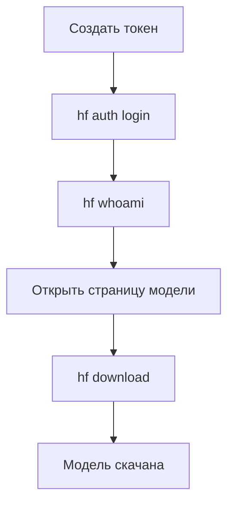

# 🚀 FastAPI Foundry

**REST API для локальных AI моделей с поддержкой RAG**

FastAPI Foundry - это современный REST API сервер для работы с локальными AI моделями через Foundry, с интегрированной системой поиска и извлечения контекста (RAG).

## ✨ Возможности

- 🤖 **Генерация текста** через локальные AI модели (DeepSeek, Qwen, Mistral, Llama)
- 💬 **Интерактивный чат** с AI моделями с поддержкой сессий разговора
- 🔍 **RAG система** для поиска контекста в документации проекта
- 🗑️ **Управление RAG** - очистка индекса через веб-интерфейс
- 📦 **Пакетная обработка** множественных запросов
- 🔐 **Безопасность** через API ключи и CORS защиту
- 📊 **Мониторинг** здоровья сервиса и моделей
- 🐳 **Docker** поддержка для легкого развертывания
- 🌐 **Веб-интерфейс** для управления моделями и чата
- 🔌 **MCP сервер** для интеграции с Claude Desktop и другими MCP клиентами
- ⚙️ **Управление Foundry** - запуск, остановка и мониторинг сервиса через веб-интерфейс

## 🏗️ Архитектура Foundry

FastApiFoundry использует **Microsoft Foundry Local CLI** как сервис для запуска AI моделей:

```
┌─────────────────┐    HTTP REST API    ┌──────────────────┐    CLI Commands    ┌─────────────────┐
│   FastAPI       │ ──────────────────► │  Foundry Local   │ ─────────────────► │   AI Models     │
│   (Port 9696)   │                     │  (Port 50477)    │                    │   (ONNX/Local)  │
└─────────────────┘                     └──────────────────┘                    └─────────────────┘
```

**Подробная документация:**
- 📖 **[Архитектура Foundry](docs/foundry_architecture.md)** - Как работает интеграция
- 🔧 **[Техническая интеграция](docs/foundry_integration.md)** - Детали реализации

## 🚀 Быстрый старт

### ⚡ Удобный запуск (EXE) — Рекомендуется для Windows
Для максимального удобства используйте готовые исполняемые файлы в корневой директории:
- **`install.exe`** — Установка в один клик (создает venv, ставит зависимости, настраивает .env).
- **`launcher.exe`** — Запуск графического меню управления и сервера.

### 🔧 Интуитивный лаунчер (PowerShell)
Если вы предпочитаете консоль:
```powershell
# Интерактивное меню выбора
.\launcher.ps1

# Или прямой быстрый запуск
.\launcher.ps1 -Mode quick
```

> 📚 **Полная документация:** [LAUNCHER.md](LAUNCHER.md)

### 🎯 Доступные режимы:
- **🎯 Быстрый запуск** - Автоустановка + Foundry + FastAPI
- **🐍 Только API** - Без Foundry, только веб-интерфейс  
- **🔧 Разработка** - С подробным выводом
- **🐳 Docker** - Запуск в контейнере
- **⚙️ Настройка** - Конфигурация .env
- **🔍 Диагностика** - Проверка системы

### ⚡ Ручной запуск

```bash
# Если Foundry уже работает
python run.py

# Или с виртуальным окружением
venv\Scripts\python.exe run.py
```

### 🛠️ Диагностика и управление

```powershell
# Лаунчер с диагностикой
.\launcher.ps1 -Mode diag

# Настройка переменных окружения
.\launcher.ps1 -Mode setup

# Проверка конфигурации
python check_env.py
```

> 📖 Подробная инструкция: [TROUBLESHOOTING.md](TROUBLESHOOTING.md)

## 📁 Структура проекта

```
FastApiFoundry-Docker/
├── src/                   # Исходный код
│   ├── api/              # FastAPI приложение
│   │   ├── endpoints/    # API endpoints
│   │   ├── app.py       # Фабрика приложения
│   │   └── main.py      # Точка входа
│   ├── core/             # Конфигурация
│   │   └── config.py    # Настройки
│   ├── models/           # AI модели
│   │   └── foundry_client.py
│   ├── rag/              # RAG система
│   │   └── rag_system.py
│   └── utils/            # Утилиты
├── static/              # Веб-интерфейс
├── docs/                # Документация
├── examples/            # Примеры использования
├── mcp-servers/         # MCP серверы
├── rag_index/           # RAG индекс и chunks
├── logs/                # Логи системы
├── venv/                # Виртуальное окружение Python
├── start.ps1           # Скрипт запуска (Windows)
├── run.py              # Основной скрипт запуска
├── config.json         # Конфигурация
├── docker-compose.yml  # Docker конфигурация
└── requirements.txt    # Зависимости Python
```

## 🔧 Технологии

- **FastAPI** - Современный веб-фреймворк
- **Foundry** - Локальные AI модели
- **FAISS** - Векторный поиск для RAG
- **sentence-transformers** - Эмбеддинги для RAG
- **Uvicorn** - ASGI сервер
- **Docker** - Контейнеризация
- **Python 3.11+** - Основной язык

## ⚙️ Конфигурация

### 📁 Файлы настроек
- **`config.json`** - Основная конфигурация приложения
- **`.env`** - Переменные окружения (чувствительные данные)
- **`docker-compose.yml`** - Docker настройки

### 🔐 Настройка переменных окружения

1. **Скопируйте пример файла:**
   ```bash
   cp .env.example .env
   ```

2. **Заполните ваши данные в `.env`:**
   ```env
   # GitHub Configuration
   GITHUB_USER=your_username
   GITHUB_PAT=ghp_your_personal_access_token
   
   # API Configuration
   API_KEY=your_secret_api_key
   SECRET_KEY=your_jwt_secret_key
   ```

3. **Проверьте конфигурацию:**
   ```bash
   python check_env.py
   ```

📖 **Подробная документация:** [docs/environment.md](docs/environment.md)

### 🤖 Автозагрузка модели по умолчанию

Для автоматической загрузки модели при старте установите в `config.json`:

```json
{
  "foundry_ai": {
    "auto_load_default": true,
    "default_model": "deepseek-r1-distill-qwen-7b-generic-cpu:3"
  }
}
```

### 🔍 RAG система

RAG система автоматически индексирует документацию проекта:

- **Индекс**: `rag_index/` - FAISS индекс и метаданные
- **Управление**: Веб-интерфейс → Settings → RAG System
- **Очистка**: Кнопка "Очистить RAG chunks" в настройках

### 📚 Документация

### Начало работы
- **[Лаунчер](LAUNCHER.md)** - Интуитивный интерфейс запуска (все режимы)
- **[Установка](INSTALL.md)** - Системные требования и установка
- **[Настройка](docs/configuration.md)** - Конфигурация через .env файл
- **[Запуск](docs/running.md)** - Режимы запуска и опции
- **[Переменные окружения](docs/environment.md)** - Настройка .env файла

### Использование
- **[Использование](docs/usage.md)** - Веб-интерфейс и REST API
- **[API Reference](docs/api.md)** - Полная документация по REST API
- **[API Детально](docs/api/)** - Подробная документация по каждому endpoint
- **[Примеры](docs/examples.md)** - Полные примеры кода и сценарии использования
- **[Практические рецепты](docs/howto.md)** - Настройка RAG, подключение моделей, автоматизация

### Разработка
- **[Разработка](docs/development.md)** - Архитектура и добавление функций
- **[Развертывание](docs/deployment.md)** - Docker, Nginx, systemd

### Дополнительно
- **[Docker](docs/docker.md)** - Контейнеризация и развертывание
- **[Информация о проекте](docs/project_info.md)** - Детальная информация
- **[Туннели](docs/tunnel_guide.md)** - Публичный доступ через ngrok/Cloudflare

## 🗂️ Где скачать GGUF модели

GGUF-модели (Gemma, Mistral, Qwen и др.) распространяются через экосистему **Hugging Face**.

### Основной источник — Hugging Face

Ищите модель с добавлением `GGUF` в поиске:

- Gemma: https://huggingface.co/models?search=gemma+gguf
- Mistral: https://huggingface.co/models?search=mistral+gguf
- Qwen: https://huggingface.co/models?search=qwen+gguf

Примеры репозиториев:
- [LiteLLMs/gemma-7b-GGUF](https://huggingface.co/LiteLLMs/gemma-7b-GGUF)
- [TheBloke/Mistral-7B-v0.1-GGUF](https://huggingface.co/TheBloke/Mistral-7B-v0.1-GGUF)

### Скачивание через CLI (рекомендуется)

```bash
pip install huggingface-hub
huggingface-cli login

# Скачать только один файл квантования
huggingface-cli download TheBloke/Mistral-7B-v0.1-GGUF \
  --include "*Q4_K_M.gguf" \
  --local-dir ~/.models
```

> ⚠️ GGUF-репозитории содержат десятки вариантов квантования (Q2, Q4, Q5, Q8). Скачивайте **только один файл**, а не весь репозиторий.

### Какое квантование выбрать

| Вариант | Рекомендация |
|---------|--------------|
| **Q4_K_M** | Лучший баланс качества и размера — брать по умолчанию |
| **Q5_K_M** | Лучше качество, если хватает RAM/VRAM |
| Q2 / Q3 | Только если очень мало памяти, качество заметно хуже |
| Q8 | Почти оригинальное качество, но большой размер |

### Проверенные кураторы GGUF

- **bartowski** — самые актуальные квантования, лучшие сборки под Llama/Qwen
- **unsloth** — быстрые и качественные кванты
- **TheBloke** — огромный архив (Mistral, Gemma и др.)


Собрал для тебя цельный **production-ориентированный how-to**: от нуля до скачивания GGUF модели с Hugging Face (включая все подводные камни, на которые ты уже наткнулся).

---

# 📘 HOWTO: Скачивание GGUF моделей (Gemma) через Hugging Face CLI

## 1. 📦 Установка CLI

Работа ведётся через пакет:

```bash
pip install huggingface_hub
```

Проверка:

```bash
hf --help
```

---

## 2. 🔐 Авторизация (обязательно для gated моделей)

Модели от Google (включая Gemma) — **закрытые (gated)**.

### Шаг 1. Создать токен

👉 [https://huggingface.co/settings/tokens](https://huggingface.co/settings/tokens)

Параметры:

```text
Role: Read
```

---

### Шаг 2. Логин в CLI

```bash
hf auth login
```

Вставить токен (ввод не отображается).

На вопрос:

```text
Add token as git credential? (Y/n)
```

👉 ответ:

```text
Y
```

---

### Шаг 3. Проверка

```bash
hf whoami
```

Ожидаемый результат:

```text
<your_username>
```

---

## 3. 📜 Принятие лицензии

Перейти в браузере:

👉 [https://huggingface.co/google/gemma-7b-GGUF](https://huggingface.co/google/gemma-7b-GGUF)

Особенность:

* кнопки **“Agree” может не быть**
* достаточно:

  * быть залогиненым
  * открыть страницу модели

---

## 4. 📥 Скачивание модели

### Базовая команда

```bash
hf download google/gemma-7b-GGUF --local-dir C:\Users\<user>\.models
```

📌 Важно:

* на Windows лучше **не использовать `~`**
* использовать абсолютный путь

---

## 5. ⚠️ Типичная ошибка

### ❌ 401 Unauthorized

```text
GatedRepoError: 401 Client Error
```

### Причины:

| Причина          | Решение                 |
| ---------------- | ----------------------- |
| Нет логина в CLI | `hf auth login`         |
| Не принят доступ | открыть страницу модели |
| Неверный токен   | пересоздать токен       |

---

## 6. ⚠️ Особенность Google GGUF

Модель из репозитория:

* google/gemma-7b-GGUF

имеет:

```text
FP32 (float32)
~30GB
```

👉 Это НЕ готовый вариант для локального inference.

---

## 7. 🔥 Рекомендованный путь (production)

Вместо Google-репозитория использовать уже квантованные сборки:

### Пример:

```bash
hf download bartowski/gemma-7b-it-GGUF --local-dir D:\models\gemma
```

или:

```bash
hf download TheBloke/gemma-7B-it-GGUF --local-dir D:\models\gemma
```

---

## 8. 📊 Выбор квантования

| Тип    | Размер  | Назначение        |
| ------ | ------- | ----------------- |
| Q4_K_M | ~4–5 GB | оптимально        |
| Q5_K_M | ~5–6 GB | лучше качество    |
| Q8_0   | ~8–9 GB | максимум качества |

---

## 9. 🔍 Поиск моделей

```bash
hf search gemma GGUF
```

или через UI Hugging Face.

---

## 10. 📌 Итоговая схема



---

## 11. 💡 Практические рекомендации

* Для локального запуска → **не брать FP32**
* Для CPU → Q4_K_M
* Для GPU → Q5/Q8
* Для pipeline (FastAPI / Foundry) → сразу GGUF квант

---

## 12. 🚀 Минимальный рабочий набор

```bash
pip install huggingface_hub
hf auth login
hf download bartowski/gemma-7b-it-GGUF --local-dir D:\models\gemma
```


### Альтернативные источники

- LM Studio (встроенный каталог)
- Ollama registry (зеркалирует HF)
- GitHub Releases (редко)

---

## 📞 Поддержка

- **Документация**: http://localhost:9696/docs
- **Health Check**: http://localhost:9696/api/v1/health
- **GitHub**: https://github.com/hypo69/FastApiFoundry-Docker
- **Website**: https://aistros.com

## 📄 Лицензия

CC BY-NC-SA 4.0 - https://creativecommons.org/licenses/by-nc-sa/4.0/

---

**FastAPI Foundry v0.3.4** - часть экосистемы AiStros  
© 2025 AiStros Team